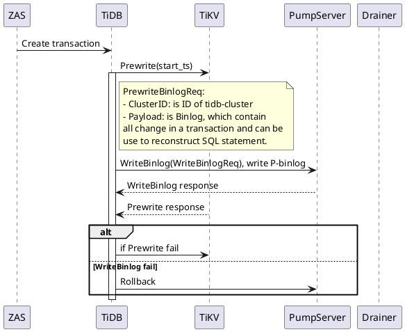

# TiDB Binlog Sequence diagram

## Transaction Overview

```plantuml
@startuml
participant ZAS
participant TiDB
participant TiKV
participant PumpServer
participant Drainer

ZAS -> TiDB: Create transaction

TiDB -> TiKV: Prewrite(start_ts)
activate TiDB
note right TiDB
PrewriteBinlogReq:
- ClusterID: is ID of tidb-cluster
- Payload: is Binlog, which contain
all change in a transaction and can be
use to reconstruct SQL statement.
end note
TiDB -> PumpServer: WriteBinlog(WriteBinlogReq), write P-binlog
PumpServer --> TiDB:  WriteBinlog response
TiKV --> TiDB: Prewrite response


alt 
TiDB -> TiKV: if Prewrite fail
else WriteBinlog fail
TiDB -> PumpServer: Rollback
end

deactivate TiDB
@enduml
```